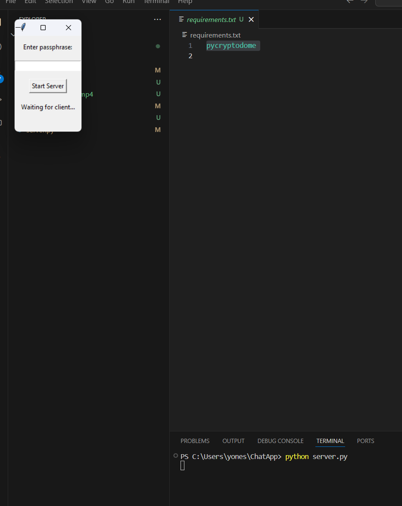
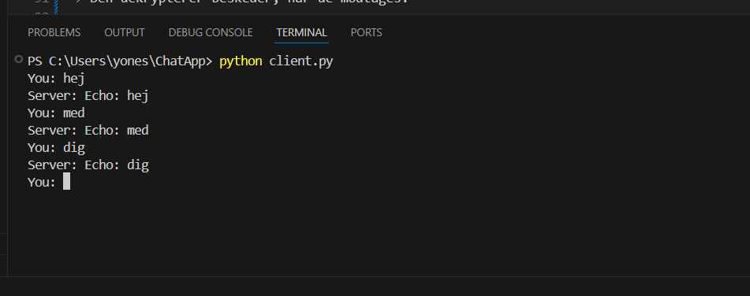
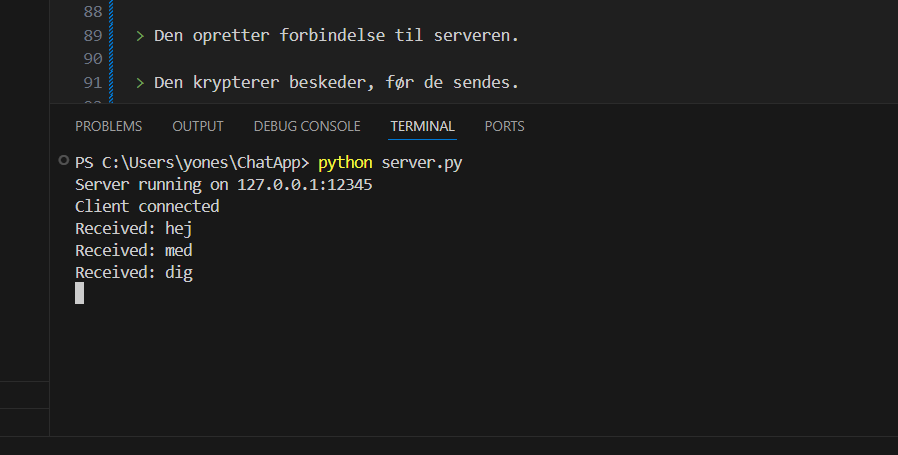

Encrypted chat - Mini Project

Opgavebeskrivelse:

The project
Implement a chat/messaging application with focus on confidentiality and integrity (security goals from CIA triad).

Given that you just learned about cryptography you should put your new gained knowledge to use.

Consider ways that a chat protocol can be implemented such that it gives reasonable protection against the security controls (integrity and confidentiality), while still being feasible to implement as a proof-of-concept, within the given time frame.

Scope
Your solution should allow two-people to communicate with each other without the risk of eavesdropping. Group chats, where more than two people send/receive messages at a time, is out scope.

Bonus if your application allows for near real-time communication. It can be achieved with WebSocket, socket.io, SignalR, TCP-socket, using a message queue or so on.

I don't expect the UI to look fancy. A simple unstyled HTML page, plain GUI or CLI/TUI is fine. The only requirement regarding UI is that it should be obvious how to use it.

Groups
Working in groups is encouraged, but I prefer no more than 4 people in a group.

Hand-in
You must hand-in a link to git repository with your code before deadline. The repository must be public.

The repository must have a README.md in the root containing instructions on how to run the solution. It also needs to describe how you use cryptography to prevent eavesdropping and why you chose to do it that way.

Please include screenshots of you solution in action.

Sådan kører du projektet:

1. Installer Python(3.10 eller nyere)

2. Clone projektet

git clone https://github.com/yonesswaidan/ChatApp

3. Installer afhængigheder i terminalen 
pip install -r requirements.txt

Kørsel:
Start serveren
python server.py
Indtast en hemmelig passphrase, som du deler med Klienten.

Start klienten
python client.py
Indtast den samme passphrase som du har brugt på serveren.

Når forbindelsen er etableret, kan du sende beskeder i terminalen.
Klienten sender, og serveren modtager beskederne

Hvordan det virker
Begge parter indtaster samme passphrase.

scrypt() bruges til at aflede en stærk 256-bit key fra passphrasen.

Beskeder krypteres med AES-GCM (som også beskytter mod ændringer).

TCP-forbindelse sender og modtager de krypterede data.

Modparten dekrypterer og verificerer med samme key.

Eksempel
> Enter passphrase: Test123
Server is running...

Client:
> Enter passphrase: Test123
You: Hej med dig!
Server: Echo: Hej med dig!

Screenshot af kørende program:

> Filbeskrivelser:

Client.py

> Dette er selve chat-klienten – altså det program, som brugeren starter for at skrive og læse beskeder.

> Den opretter forbindelse til serveren.

> Den krypterer beskeder, før de sendes.

> Den dekrypterer beskeder, når de modtages.

Server.py

> Dette er serverdelen af appen. Den modtager beskeder fra én klient og sender dem videre til en anden.

> Serveren kan ikke læse beskeden, da den er krypteret – den dekrypterer den, og sender en krypteret "Echo"-besked tilbage.

Common.py

> Denne fil indeholder én funktion, som både klienten og serveren bruger:

>  get_shared_key(passphrase): Udregner en fælles krypteringsnøgle ud fra en adgangskode.
> Den bruger algoritmen scrypt, som gør det svært for hackere at gætte adgangskoden.

Requirements.txt – Liste over hvad der skal installeres

> Denne fil bruges til at installere de pakker, som projektet har brug for:

pycryptodome

> Den indeholder alt det, Python skal bruge for at kunne køre kryptering, f.eks. AES og scrypt.

>Du installerer det med:

pip install -r requirements.txt

Teori: "It also needs to describe how you use cryptography to prevent eavesdropping and why you chose to do it that way."

Cryptography Beskyttelse mod Easvesdropping
For at sikre, at kommunikationen mellem server og klient ikke kan blive aflyttet af tredjeparter, har jeg implementeret kryptering af både beskeder og keys. Dette beskytter dataene og sikrer, at kun de parter, der kender den fælles passphrase, kan dekryptere og læse beskederne.

1. Scrypt (Password-Based Key Derivation Function)

Formål: scrypt bruges til at aflede en stærk krypteringsnøgle fra en passphrase.

Hvordan det beskytter mod eavesdropping: Når en bruger opretter forbindelse til serveren, bliver den her passphrasen brugt som input til scrypt-funktionen, og som afleder en 256-bit nøgle. Denne her key bruges til at kryptere og dekryptere beskederne. Også ved at anvende scrypt, som er designet til at være "slow" (kræver meget beregningskraft), bliver det så svært for en angriber at brute-force passphrasen, selvom de har adgang til krypterede data.

Hvorfor scrypt: Det er en af de mest effektive og sikre metoder til at aflede krypteringskeys fra en passphrase. Den øgede tid for at beregne nøglen beskytter mod forsøg på at gætte passphrase'en hurtigt ved hjælp af brute-force angreb.

2. AES-GCM (Advanced Encryption Standard - Galois/Counter Mode)
Formål: AES-GCM anvendes til kryptering af selve beskedeerne.

Hvordan det beskytter mod eavesdropping: AES-GCM er en symmetrisk krypteringsalgoritme, der både beskytter mod uautoriseret læsning (fortrolighed) og uautoriserede ændringer af beskeden (integritet). Ved at bruge en nonce (det her "engangsnummer") sammen med en autentificerings-tag i GCM-moden, sikrer jeg, at selvom en angriber får fat i krypterede data, vil de ikke kunne ændre dataene uden at blive opdaget. Hvis en ændring bliver gjort, vil dekrypteringsprocessen fejle.

Hvorfor AES-GCM: AES-GCM tilbyder både hurtig kryptering og autentificering i én proces. Det giver en stærk beskyttelse mod både aflytning og manipulation af data, hvilket gør det ideelt til kommunikation, hvor både fortrolighed og integritet er indblandet. 

3. TCP Forbindelse til Kommunikation
Formål: TCP (Transmission Control Protocol) bruges til at sende og modtage beskeder over netværket.

Hvordan det beskytter mod eavesdropping: Selvom TCP ikke tilbyder kryptering som standard, er det en pålidelig metode til at sikre, at dataene når frem til modtageren uden at blive tabt eller ødelagt undervejs(Man-In-The-Middle angreb). Når krypteringen af beskederne er implementeret, sikrer det, at dataene er beskyttet under hele proccesen.

Hvorfor TCP: TCP er en af de mest pålidelige transportprotokoller, der sikrer, at dataene leveres korrekt og i den rigtige rækkefølge. I kombination med kryptering sikrer det en effektiv og pålidelig metode til kommunikation.

Hvorfor Valgte jeg lige netop disse Krypteringsmetoder?
Sikkerhed: Krypteringsmetoderne, AES-GCM og scrypt, giver en stærk beskyttelse mod aflytning, da de begge er veldokumenterede og anerkendte som sikre i cryptography "community".

Ydeevne: AES-GCM er en hurtig og effektiv algoritme, der er velegnet til realtidskommunikation. Det gør det muligt at sende beskeder hurtigt uden at gå på kompromis med sikkerheden.

Praktik: Implementeringen af symmetrisk kryptering som AES-GCM gør det muligt at kryptere og dekryptere beskeder hurtigt, mens brugen af scrypt til nøgleafledning gør det muligt at beskytte nøglerne mod brute-force angreb.

Beskyttelse mod Andre Trusler
Man-in-the-Middle (MITM) Angreb: Eftersom beskederne er krypteret med AES-GCM, selv hvis en angriber opfanger beskederne under transport, vil de ikke kunne læse dem uden at kende den korrekte nøgle. Endvidere sikrer GCM-modus, at enhver ændring af beskeden vil blive opdaget.

Replay Angreb: Selvom replay angreb ikke specifikt er adresseret i denne løsning, kan den nuværende kryptering og autentificering i AES-GCM give beskyttelse mod ændringer og sikre integriteten af beskeden.

Konklusion
Denne løsning sikrer, at kommunikationen mellem to parter er krypteret og beskyttet mod aflytning (eavesdropping) ved at bruge scrypt til nøgleafledning og AES-GCM til kryptering og autentificering af beskeder. Ved at implementere disse Cyptography metoder kan jeg sikre, at kun de beregnede parter har adgang til den oprindelige besked og kan kommunikere uden risiko for, at nogen uautoriseret læser eller manipulerer kommunikationen.

Inddragelse af noter og pointer fra undervisningen om kryptografi:
Projektet benytter flere grundlæggende CCryptography teknikker for at sikre kommunikationen mellem klient og server mod easvesdropping og uautoriseret adgang. Herunder vil vi se på, hvordan de anvendte metoder relaterer sig til kryptografi-teori og undervisningens pointer.

Symmetrisk kryptering med AES-GCM:

AES (Advanced Encryption Standard) er en blokciffer-algoritme, der bruges til kryptering af data i faste blokke (128 bit). I mit projekt er AES valgt på grund af dets effektivitet og pålidelighed som symmetrisk kryptering, hvor både kryptering og dekryptering sker med samme nøgle. AES arbejder effektivt med en 256-bit nøgle i GCM (Galois/Counter Mode), som er en modern og sikker krypteringsmode, der kombinerer både kryptering og autentificering. Dette beskytter mod ændringer i den krypterede data, altså integritet og forhindrer eavesdropping.

Ifølge undervisningen er GCM et godt valg, da det sikrer både fortrolighed og integritet af dataene i realtid, hvilket gør det særligt velegnet til bl.a. online kommunikation.

Scrypt og nøgleudveksling:

For at skabe en fælles nøgle mellem klient og server, benyttes scrypt, en nøgleafledningsfunktion. Denne funktion gør det vanskeligt for angribere at udlede den oprindelige adgangskode fra den genererede nøgle, da scrypt kræver betydelig beregningskraft (altså specifikt tid) for at afkode.

Scrypt hjælper også med at beskytte mod brute-force angreb som nævnt, hvilket er en vigtig del af systemets sikkerhed.

Diffie-Hellman Key Exchange (DHKE):

Selvom DHKE ikke er implementeret direkte i denne version af systemet, kunne det være en nyttig funktion til fremtidige versioner af projektet. DHKE tillader, at to parter kan udveksle en hemmelig nøgle over en usikker kanal uden at dele den direkte. Denne metode blev nævnt i undervisningen og kunne anvendes til nøgleudveksling i en udvidet version af systemet, hvilket ville styrke sikkerheden i kommunikationen, da det ville gøre det umuligt for en tredjepart at aflytte og udlede nøglen.

Kerckhoffs' princip:

I overensstemmelse med Kerckhoffs' princip, som siger, at et kryptosystem skal være sikkert selv hvis algoritmen er offentlig, bygger mit løsning på velkendte og stærkt testede kryptografiske algoritmer som AES og scrypt. Dette betyder, at sikkerheden af løsningen ikke afhænger af hemmeligheden af de anvendte algoritmer, men kun af keys, hvilket gør systemet robust mod potentielle angreb.

Brug af hashfunktioner til integritet:

Mens hashfunktioner som SHA-256 ikke er direkte implementeret i denne version, kunne de anvendes til at kontrollere dataintegriteten i en udvidet version af applikationen. Eksempelvis kunne serveren og klienten bruge hashes til at verificere, at de modtagne beskeder ikke er blevet ændret under transmissionen, hvilket kunne beskytte kommunikationen mod manipulation endnu mere.

Ideer til videreudvikling af projektet:
Autentificering af brugere:

For at forbedre sikkerheden kan autentificering tilføjes, f.eks. ved hjælp af RSA eller Ed25519 digitale signaturer. Dette kunne sikre, at både klient og server er de aktører, de udgiver sig for at være, og hindre man-in-the-middle-angreb.

Nøgleudveksling med Diffie-Hellman:

For at sikre en dynamisk nøgleudveksling uden at dele nøglen på forhånd, kan Diffie-Hellman Key Exchange (DHKE) implementeres. Dette ville forbedre sikkerheden, især i situationer, hvor parterne ikke har nogen forudgående kommunikation.

Post-Quantum Kryptografi (PQC):

Som cryptography fortsætter med at udvikle sig, og "kvantecomputere" bliver en realitet, kan post-quantum kryptografi (PQC) blive relevant. Algoritmer som Crystals-Kyber og Falcon kunne implementeres i fremtidige versioner for at sikre, at systemet er modstandsdygtigt overfor kvanteangreb.
